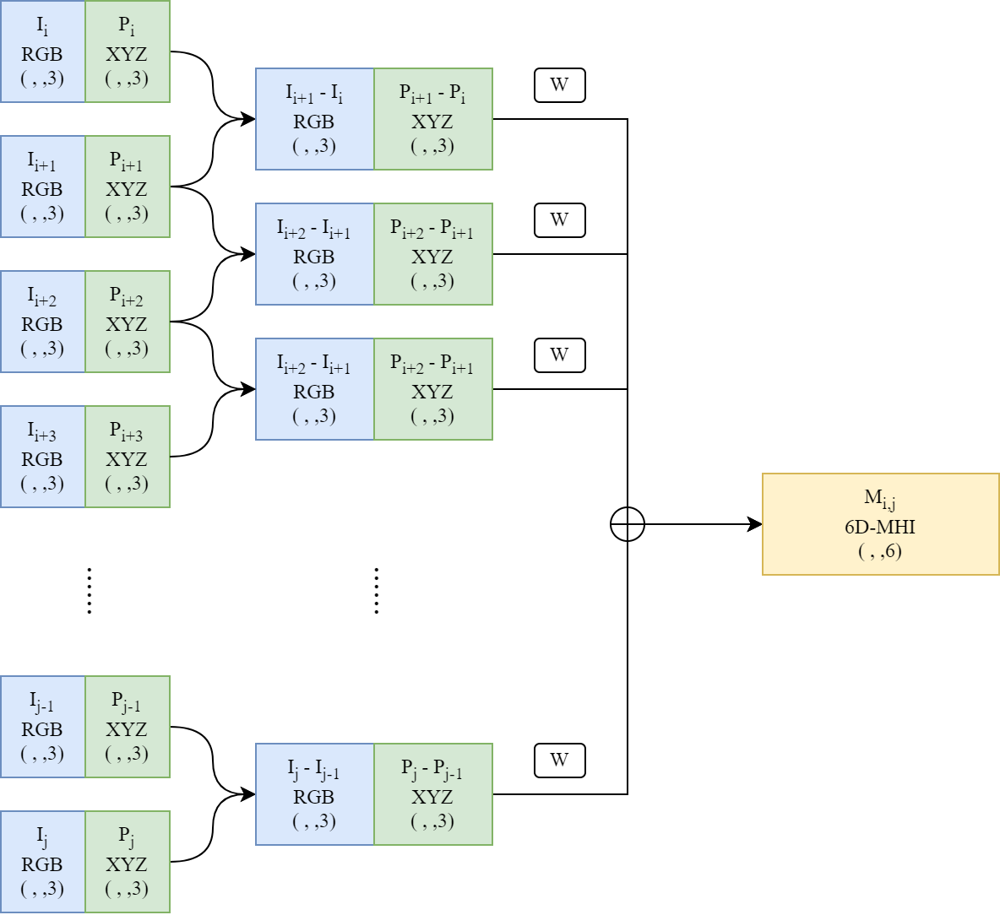
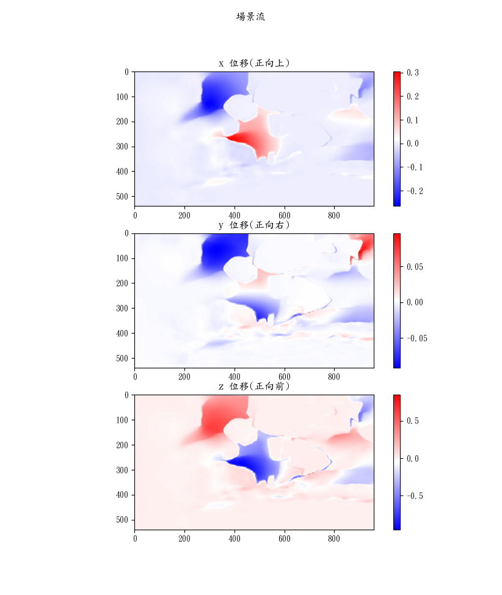
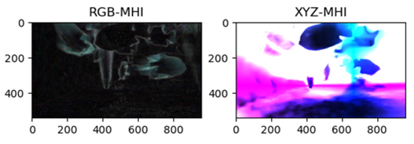

# 基於 Transformer 光流偵測架構之立體影像場景流估算及 3D 物件行為辨識

[台灣碩博士論文加值系統](https://hdl.handle.net/11296/7k8dns)  
Stereo Video Based Scene Flow  Estimation using Transformer Optical Flow Detection for 3D Object Activity Recognition  

研究生: 何培魁  
指導教授: 鄭錫齊 博士  
Student: Pei-Kuei Ho  
Advisor: Shyi-Chyi Cheng  

## 摘要

本研究提出了一種基於 Transformer 光流偵測架構的立體影像場景流估算方法及其在 3D 物件行為辨識之應用，以立體影像為輸入，本論文旨在提出一深度學習處理架構，用來精確估計 3D 場景流，並據以製作運動歷史影像，輸入到 Transformer物件偵測器，用來識別各物件的運動行為，實現對場景流及物件行為辨識的高效估算。本系統的架構分兩部分，首先，我們以立體影像作為輸入，使用 Transformer 深度學習模型，進行光流估算和視差計算，準確捕捉了影像中的二維運動資訊和深度訊息。接著，透過場景流與光流的投影關係，將像素平面上的光流與深度訊息融合，進行場景流的估算。得益於 Transformer 光流方法的準確度，我們得以產生更為準確的場景流預測結果。第二階段，在物件行為辨識方面，我們使用前項計算中所產生的點雲與立體影像融合，使用影像序列及點雲序列的運動訊息產生 6D 運動歷史影像(Motion History Image；MHI)，其中包含了豐富的時空特徵。並以 6D-MHI 作為DETR-Transformer 物件偵測模型的輸入，用於偵測 3D 物件及辨識其運動行為。在實驗方面，我們將提出的模型應用於水下環境中，檢驗了模型的廣泛場景應用性，並實現對魚隻行為的精確辨識。這些實驗將有助於評估模型在水下環境中的適應能力和效能，並探索其在生物行為研究和海洋監測中的應用潛力。本研究的主要貢獻包括：一、提出了一種結合 Transformer (FlowFormer)架構的先進場景流偵測方法，有效解決了傳統方法在複雜環境（如水下場景）中的準確性問題。二、採用 6D-MHI技術並應用於 DETR 模型，實現了對物件行為的時間序列計算，增強了物件行為辨識的準確性。三、進行水下實驗，將模型應用於養殖場域，驗證其泛用性。  

關鍵詞： 立體影像、光流、場景流、Transformer、DETR、運動歷史影像、影像處理、深度學習  

## Abstract

In this study, we propose a stereo-video based scene flow estimation for 3D object activity recognition using the transformer like optical flow detection. The goal is to create a deep learning model that can precisely estimate 3D scene flow using stereo video as input. Additionally, we can recognize individual multi-object activities by using the proposed transformer object detector based on the further constructed Motion History Images (MHIs). The system is divided into two parts. First, about the scene flow, for each frame of the left-video, the optical flow detector is used to estimate pixel-wise disparity values, which combines with the camera parameters to compute the resulting depth map and 3D point cloud of the input frame. Furthermore, the optical flow detector is applied to capture the pixel movement information across frames of the left video. These two information are then merged to estimate 3D scene flow. The estimation of scene flow can benefit from the high accuracy of transformer-based optical flow. Second, about the 3D object activity recognition, for each video segment, a 6D-MHI image, which contains time-space motion information, is constructed and further processed by the DETR-transformer object detection model to detect 3D objects and recognize their motion patterns. To verify the effectiveness of the proposed approaches, an IoT system is deployed at multiple underwater environments to construct training datasets for training and testing the proposed models. These works help us to evaluate the ability and performance of the model in underwater environments, and explore its potential in biological behavior research and marine monitoring. The main contributions of this thesis include: (1) An advanced scene flow estimation method is proposed to improve the accuracy compared with traditional methods in complex environments. (2) By applying 6D-MHI to the DETR model, the system can detect objects and recognize their activities from a video segment simultaneously. (3) The usage of the models in underwater experiments provides a systematic way to design the IoT system for smart aquaculture.  

Keywords: Stereo Image, Optical Flow, Scene Flow, Transformer, DETR, MHI, Image Processing, Deep Learning  

## 基於 MHI 及 Transformer 之 3D 物件行為辨識

### 系統架構

  
▲3D 物件行為辨識模型  

### 6D-MHI

  
▲6D-MHI 計算流程圖  

### MHI-DETR

  
▲MHI-DETR 模型架構圖  

## 實驗結果

### 基於Transformer光流偵測架構之3D影像場景流估算

#### KITTI場景流

  
▲KITTI 場景流資料集的 t0 左右影像(上)及 t1 左右影像(下)  
  
▲KITTI 資料集的場景流估算結果(左)與基準值(右)  

#### A13場景流

  
▲A13 資料集的 t0 左右影像(上)及 t1 左右影像(下)  

  
▲A13 資料集的場景流估算結果  

### 物件行為辨識

  
▲資料集中的魚隻行為靈活度標記  
  
▲影像區間生成之6D-MHI視覺化結果  
與標記之基準(右).png)  
▲A13資料集驗證資料辨識結果(左)與標記之基準(右)  

## 研究貢獻

本研究有三點主要貢獻:  

1. 提出立體影像建立場景流的流程: 本論文提出由立體影像建立場景流的流程，提供立體影像建立場景流的參考方法。我們由立體影像對開始，分析並討論了包含校正、視差估算、深度估算、場景流與光流的投影關係等內容。最終提供了一個立體影像建立場景流的可靠方法，並進行實驗提供結果參考。  
2. 使用Transformer光流方法建立場景流: 研究中將Transformer光流模型應用於場景流建立，展示Transformer模型用於特殊場景的穩健性，實驗結果顯示了該方法在不同環境下的優越表現，並使用Transformer光流方法取得的光流資訊進行場景流的建立。  
3. 建立基於MHI及DETR架構之3D物件行為辨識模型: 最後，我們建立了3D物件行為辨識模型並提出實際應用。該模型結合了MHI及基於Transformer的物件偵測模型，能夠提供包含時間序的四維物件行為辨識。這一方法有效的捕捉了物體的歷史變化，並且能夠有效進行行為辨識，為行為辨識提供了新的方向。  

## 結論

總結本研究的成果與發現，本研究利用先進的計算機視覺技術和創新方法，提升了立體影像場景流估算和物件行為辨識的效能和準確性，並提供了具有建設性的方法。未來的工作將繼續在這些基礎上進行深入探索，以應對更多挑戰和應用需求。我們期待透過不斷的改進與創新，這些技術將能在更多領域得到廣泛的應用，為研究領域帶來更多的突破與進展。  
